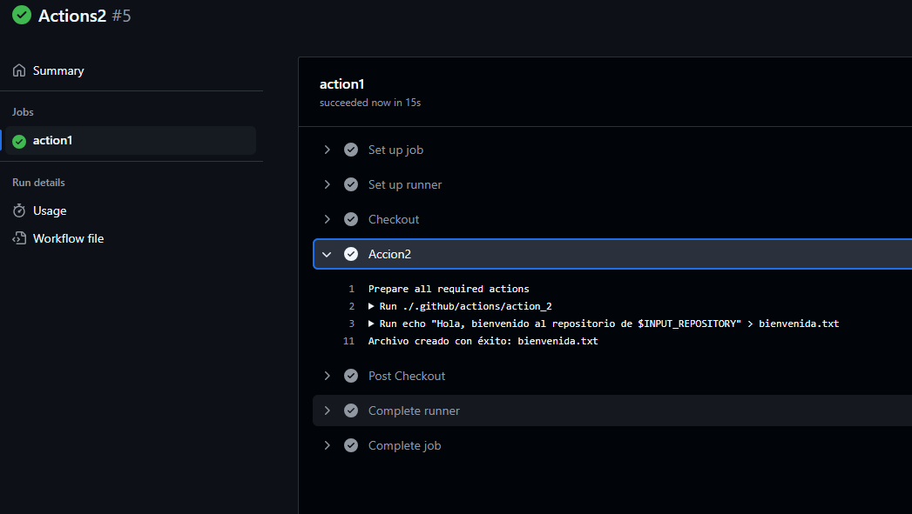
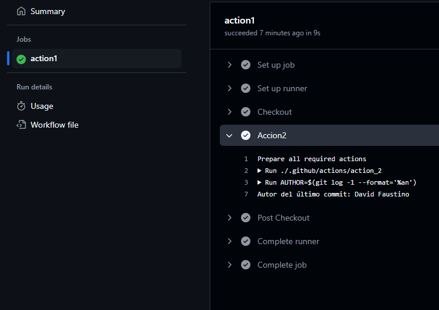
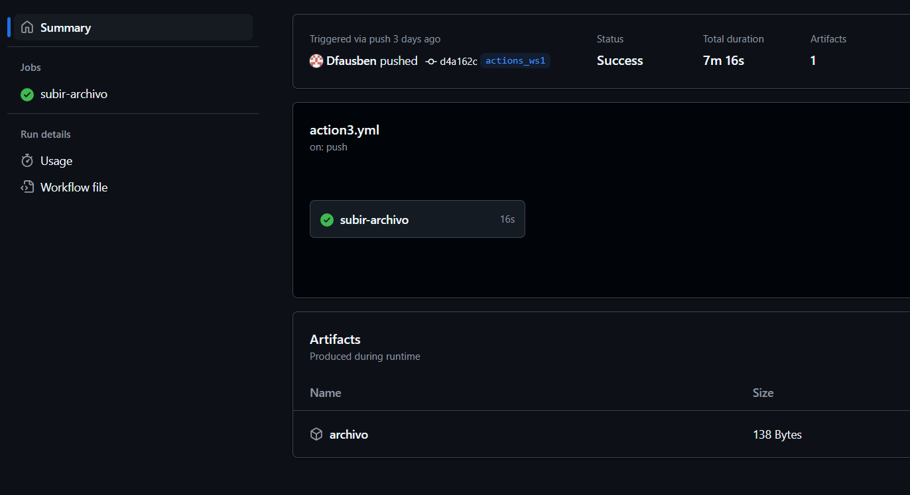

# Bloque de ejercicios - Actions

Debemos primero entender con que trabajamos, las acciones dentro de Github Actions son un paquete de código reutilizable que realiza una tarea específica en un workflow.

## Action 1 - Archivo de bienvenida

Buscamos crear un archivo que nos de la bienvenida a través de este primer action.

### Action

Definimos el yml de la acción:

````yml
# Nombre de la acción
name: Crear archivo de bienvenida

# Ejecución de la acción
runs:
  # Tipo de ejecución (en este caso, bash)
  using: "composite"
  steps:
    - run: |
        echo "Hola, bienvenido al repositorio de $INPUT_REPOSITORY" > bienvenida.txt
        if [ $? -eq 0 ]; then
          echo "Archivo creado con éxito: bienvenida.txt"
        else
          echo "Error al crear el archivo"
        fi
      shell: bash
````

Necesitaremos de un workflow para realizar la llamada de nuestra action:

### Workflow de llamada

````yml
name: Actions1

on:
  workflow_dispatch:

jobs:
  action:
    runs-on: labs-runner
    steps:
      - name: Checkout
        uses: actions/checkout@v4

      - name: Acción1
        uses: ./.github/actions/action_1
````

### Ejecución

Observamos el proceso de ejecución de nuestra action y workflow



## Action 2 - Comprobar el autor del último commit

Con esta action podremos identificar de forma sencilla el autor del último commit.

### Action

````yml
name: Autor del último commit
runs:
  using: "composite"
  steps:
    - run: |
        AUTHOR=$(git log -1 --format='%an')
        echo "Autor del último commit: $AUTHOR"
      shell: bash
````

### Workflow de llamada

````yml
name: Actions2

on:
  workflow_dispatch:

jobs:
  action1:
    runs-on: labs-runner
    steps:
      - name: Checkout
        uses: actions/checkout@v4
      - name: Accion2
        uses: ./.github/actions/action_2
````

### Ejecución



## Action 3 - Subida y bajada de artefactos

Un artefacto (en inglés, *artifact*) es un archivo generado durante la ejecución de un workflow y se almacena en GitHub para su posterior uso. 

### Workflow/Action

````yml
# Definimos el nombre del workflow
name: Subir y descargar archivo

# Seleccionamos el evento que dispara el workflow (push a la rama main)
on:
  push:
    branches:
      - main
      - actions_ws1

# Definimos el job que se ejecutará
jobs:
  subir-archivo:
    # Seleccionamos el entorno en el que se ejecutará el job (labs-runner)
    runs-on: labs-runner
    steps:
      # Checkout del código para poder trabajar con él
      - name: Checkout código
        uses: actions/checkout@v3
      # Subimos el archivo como un artefacto
      - name: Subir archivo
        uses: actions/upload-artifact@v4
        with:
          # Nombre del artefacto
          name: archivo
          # Ruta del archivo que se subirá
          path: archivo.txt
          # Falla la acción y muestra un mensaje de error
          if-no-files-found: error
          # Sobreescribe el artefacto si ya existe
          overwrite: true
      # Descargamos el archivo que se subió anteriormente
      - name: Descargar archivo
        uses: actions/download-artifact@v4
        with:
          # Nombre del artefacto que se descargará
          name: archivo
      # Mostramos el contenido del archivo descargado
      - name: Mostrar contenido del archivo
      # Comando para mostrar el contenido del archivo
        run: |
          cat archivo.txt
````

### Ejecución

