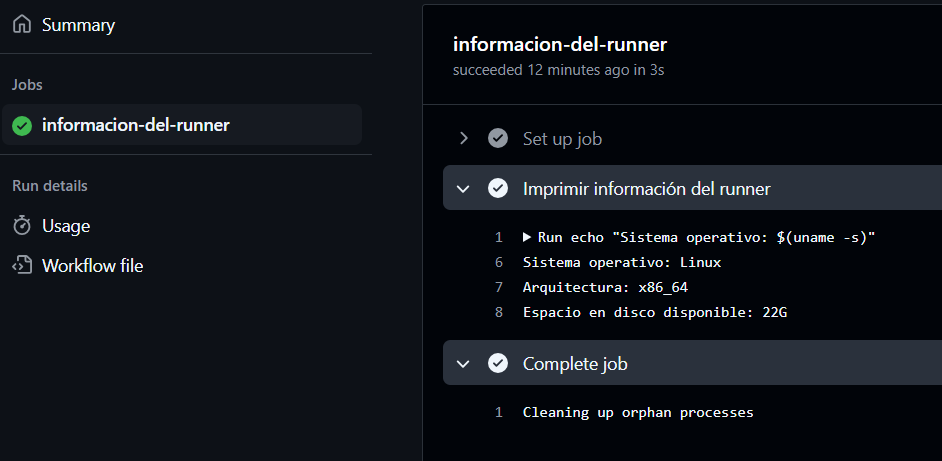
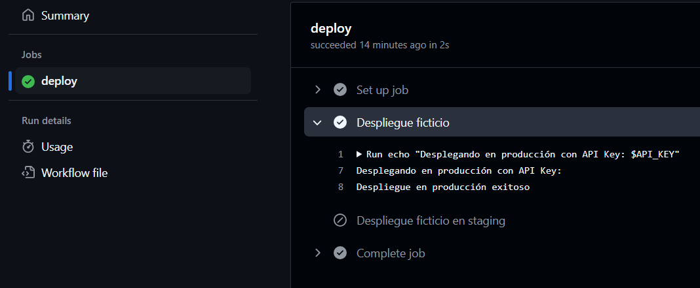
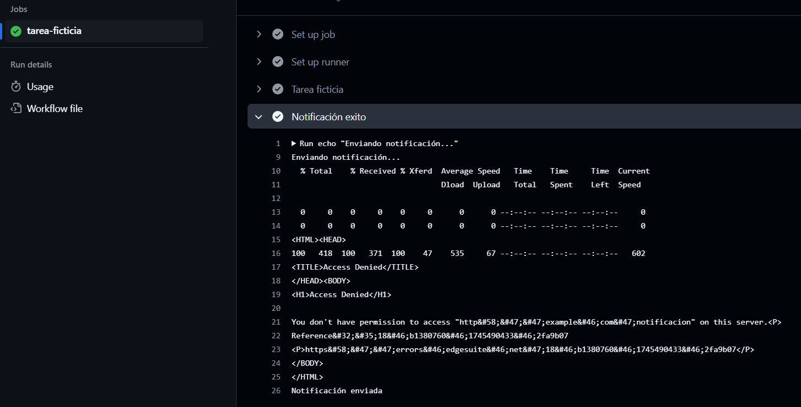
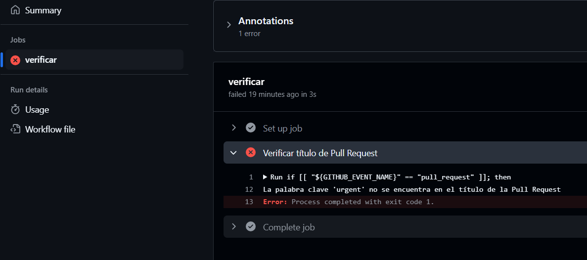

# Bloque de ejercicios - Contexts

## Context 1 - Información sobre el runner

A través de un workflow obtendremos información relativa al runner.

### Workflow

Definimos el workflow:

````yml
# Definimos el nombre del workflow
name: Información del runner

# Seleccionamos el evento que dispara el workflow (push a la rama main)
on:
  push:
    branches:
      - main
      - actions_ws1

# Definimos el trabajo que se va a ejecutar
jobs:
  informacion-del-runner:
    # Seleccionamos el entorno de ejecución (labs-runner)
    runs-on: labs-runner
    # Definimos los pasos que se van a ejecutar
    steps:
      # Paso 1: Imprimir información del runner
      - name: Imprimir información del runner
        # Comando que se va a ejecutar
        # Imprimimos el sistema operativo, la arquitectura del sistema,
        # el espacio en disco disponible en la raíz del sistema
        run: |
          echo "Sistema operativo: ${RUNNER_OS}"
          echo "Arquitectura: ${RUNNER_ARCH}"
          echo "Espacio en disco disponible: $(df -h / | awk 'NR==2 {print $4}')"
````

### Ejecución

Observamos el proceso de ejecución de nuestro workflow



## Context 2 - Simulación de despligue con condición

Pretenderemos simular un despligue que dependiendo de en que rama se realice haga diferentes acciones.

### Workflow

Definimos el workflow:

````yml
# Definimos el nombre del despliegue ficticio
name: Despliegue ficticio

# Seleccionamos el evento que dispara el despliegue (push a una rama)
on:
  push:
    # Seleccionamos las ramas que disparan el despliegue (main y cualquier otra rama)
    branches:
      - main
      - '*'

# Definimos el trabajo de despliegue
jobs:
  deploy:
    # Seleccionamos el entorno de ejecución (labs-runner)
    runs-on: labs-runner
    # Definimos los pasos del trabajo de despliegue
    steps:
      # Paso 1: Despliegue ficticio en producción
      - name: Despliegue ficticio
        # Condición para ejecutar este paso (solo si la rama es main)
        if: github.ref == 'refs/heads/main'
        # Definimos la variable de entorno API_KEY con el valor secreto PROD_API_KEY
        env:
          API_KEY: ${{ secrets.PROD_API_KEY }}
        # Comando de despliegue ficticio en producción
        # Imprimimos un mensaje de despliegue en producción con la API Key 
        # y un mensaje de despliegue exitoso en producción
        run: |
          echo "Desplegando en producción con API Key: $API_KEY"
          echo "Despliegue en producción exitoso"

      # Paso 2: Despliegue ficticio en staging
      - name: Despliegue ficticio en staging
        # Condición para ejecutar este paso (solo si la rama no es main)
        if: github.ref != 'refs/heads/main'
        # Definimos la variable de entorno API_KEY con el valor secreto STAGING_API_KEY
        env:
          API_KEY: ${{ secrets.STAGING_API_KEY }}
        # Comando de despliegue ficticio en staging
        # Imprimimos un mensaje de despliegue en staging con la API Key
        # y un mensaje de despliegue exitoso en staging
        run: |
          echo "Desplegando en staging con API Key: $API_KEY"
          echo "Despliegue en staging exitoso"


# Debemos reemplazar las API_KEYS con los nombres reales de 
# los secretos configurados para el repositorio en GitHub
````

### Ejecución

Observamos el proceso de ejecución de nuestro workflow y observamos que se cumple el condicional



## Context 3 - Notificación dependiendo del trabajo

Volvemos a un caso parecido al anterior añadiendo un notificación del trabajo (entender que al tratarse de una simulación, habría que tener en cuenta más pasos de configuración para una correcta salida). 

### Workflow

Definimos el workflow:

````yml
# Definimos el nombre de la tarea ficticia y la notificación
name: Tarea ficticia y notificación

# Seleccionamos el evento que dispara la tarea (push a la rama main)
on:
  workflow_dispatch:

# Definimos el trabajo que se realizará (tarea-ficticia)
jobs:

  tarea-ficticia:
    # Seleccionamos el entorno de ejecución (labs-runner)
    runs-on: labs-runner
    # Definimos los pasos que se realizarán en la tarea
    steps:
      # Paso 1: Tarea ficticia
      - name: Tarea ficticia
        # Ejecutamos un comando que simula una tarea ficticia
        run: |          
          echo "Realizando tarea ficticia..."
          sleep 5          
          echo "Tarea ficticia completada"
      # Paso 2: Notificación
      - name: Notificación exito
        if: job.status == 'success'
        run: |
          echo "Enviando notificación..."
          curl -X POST \
            -H "Content-Type: application/json" \
            -d '{"estado":"exito","evento":"'"$GITHUB_EVENT_NAME"'"}' \
            https://example.com/notificacion
          echo "Notificación enviada"

      - name: Notificación
        if: job.status != 'success'
        run: |
          echo "Enviando notificación..."
          curl -X POST \
            -H "Content-Type: application/json" \
            -d '{"estado":"fallo","evento":"'"$GITHUB_EVENT_NAME"'"}' \
            https://example.com/notificacion
          echo "Notificación enviada"
````

### Ejecución

Observamos el proceso de ejecución de nuestro workflow (para una correcta salida tendremos que tener en cuenta sustituir valores como la URL a la que se notifica con la adecuada configuración sobre el servidor host).



## Context 4 - Trabajar con títulos de Pull Request

Añadimos un condicional que dependiendo del titulo del PR nos permita realizar diferentes acciones.

### Workflow

Definimos el workflow:

````yml
# Definir el nombre del workflow
name: Verificar Pull Request

# Definir el evento que dispara el workflow
on:
  # El workflow se dispara cuando se abre un pull request
  pull_request:
    # Tipos de eventos que disparan el workflow
    types: [opened]

# Definir el job que se ejecutará
jobs:
  # Nombre del job
  verificar:
    # Definir la imagen de Docker que se utilizará
    runs-on: labs-runner
    # Definir los pasos que se ejecutarán
    steps:
      # Nombre del paso
      - name: Verificar título de Pull Request

        # Comando que se ejecutará en el paso
          # 1- Verificar si el evento es un pull request
          # 2- Verificar si la palabra clave 'urgent' se encuentra en el título del pull request
          # 3- Si la palabra clave se encuentra, enviar un mensaje de alerta
          
        run: |
          if [[ "${GITHUB_EVENT_NAME}" == "pull_request" ]]; then
            if [[ "${GITHUB_EVENT_PATH}" =~ "urgent" ]]; then
              echo "Título de Pull Request: ${GITHUB_EVENT_PATH}"
              echo "Cuerpo de Pull Request: ${GITHUB_EVENT_BODY}"
            else
              echo "La palabra clave 'urgent' no se encuentra en el título de la Pull Request"
              exit 1
            fi
          fi
````

### Ejecución

Observamos el proceso de ejecución de nuestro workflow y vemos que se produce un error (previsto) dado que la palabra "urgent" no se encontraba en el título del Pull Request.

