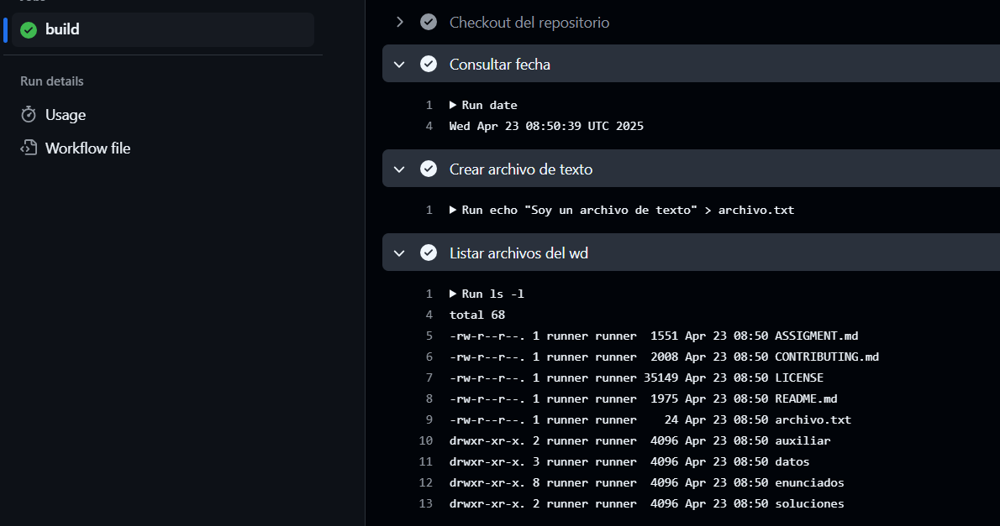
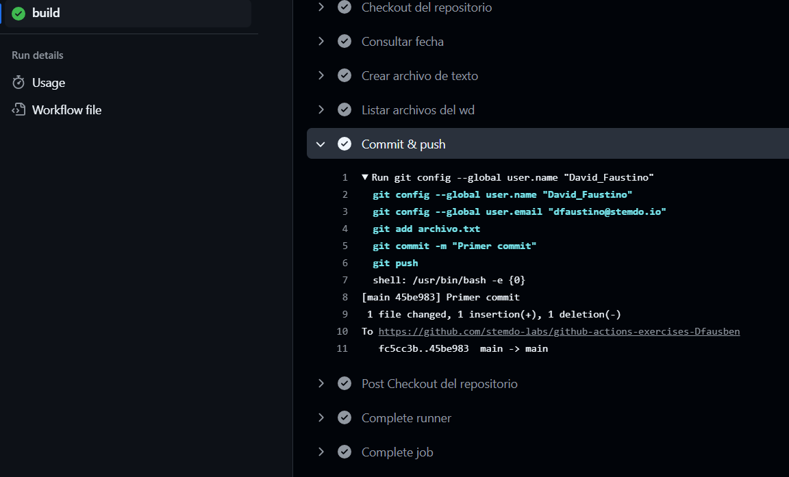
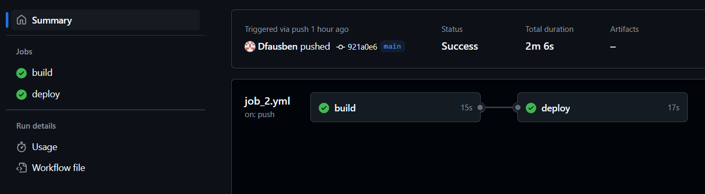
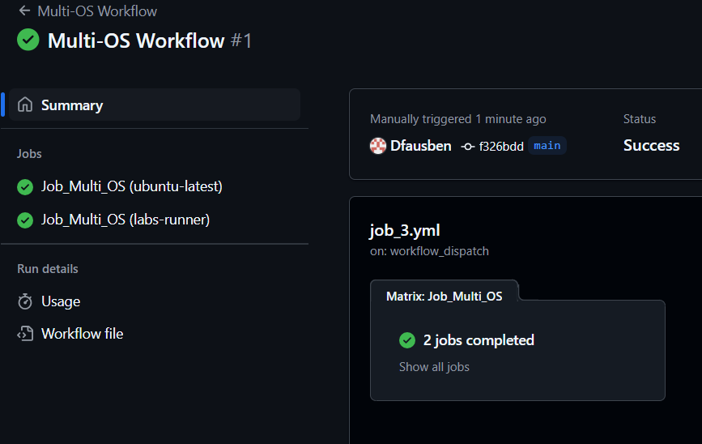
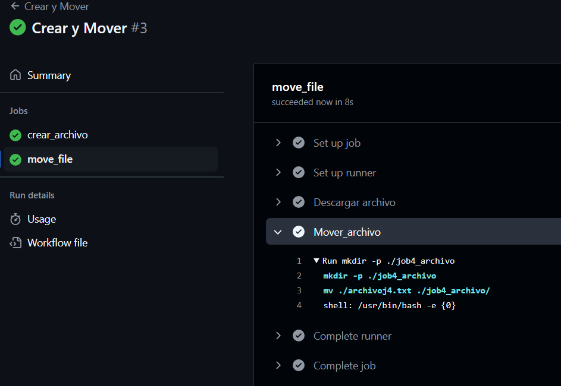

# Bloque de ejercicios - Jobs

## Job 1 - Multitarea manual

A través de un workflow manual queremos realizar una serie de acciones como hacer un commit & push.

### Workflow

Definimos el workflow:

````yml
# Definimos el nombre del workflow
name: Multitarea manual

# Definimos el evento que dispara el workflow
on:
  # El workflow se dispara manualmente mediante el evento "workflow_dispatch"
  workflow_dispatch:

# Definimos los permisos del workflow
permissions:
  # El workflow tiene permiso para escribir en el contenido del repositorio
  contents: write

# Definimos el job "multitarea"
jobs:
  multitarea:
    # El job se ejecuta en el entorno "labs-runner"
    runs-on: labs-runner
    steps:
      # Paso 1: Checkout del repositorio
      - name: Checkout del repositorio
        # Utilizamos la acción "actions/checkout" para clonar el repositorio
        uses: actions/checkout@v4

      # Paso 2: Consultar fecha
      - name: Consultar fecha
        # Ejecutamos el comando "date" para mostrar la fecha actual
        run: date

      # Paso 3: Crear archivo de texto
      - name: Crear archivo de texto
        # Creamos un archivo de texto llamado "archivo.txt" con el contenido "Soy un archivo de texto"
        run: echo "Soy un archivo de texto" > archivo.txt

      # Paso 4: Listar archivos del directorio de trabajo
      - name: Listar archivos del wd
        # Ejecutamos el comando "ls -l" para mostrar los archivos del directorio de trabajo
        run: ls -l

      # Paso 5: Commit y push
      - name: Commit & push
        # Ejecutamos un bloque de comandos para realizar el commit y push
        run: |
          git config --global user.name "David_Faustino"
          git config --global user.email "dfaustino@stemdo.io"
          git add archivo.txt
          git commit -m "Primer commit"
          git push
````

### Ejecución

Observamos el proceso de ejecución de nuestro workflow





## Job 2 - Trabajos secuenciales

A través de un workflow ejecutar dos trabajos que sean secuenciales (uno no empieza hasta que el primero acaba).

### Workflow

Definimos el workflow:

````yml
# Definimos el nombre del workflow
name: Build and Deploy

# Se ejecuta el workflow cuando se realiza un push en la rama main
on:
  push:
    branches:
      - main

# Definimos el job "build"
jobs:
  build:
    # Se ejecuta el job en el entorno "labs-runner"
    runs-on: labs-runner
    # Definimos los pasos del job
    steps:
      # Paso 1: Checkout del código
      - name: Checkout code
        # Utilizamos la acción "actions/checkout@v2" para realizar el checkout
        uses: actions/checkout@v2
      # Paso 2: Ejecución del build
      - name: Run build
        # Ejecutamos un comando para realizar el build
        run: |
          echo "Building..."

# Definimos el job "deploy"
  deploy:
    # El job "deploy" depende del job "build"
    needs: build
    # Se ejecuta el job en el entorno "labs-runner"
    runs-on: labs-runner
    # Definimos los pasos del job
    steps:
      # Paso 1: Checkout del código
      - name: Checkout code
        # Utilizamos la acción "actions/checkout@v2" para realizar el checkout
        uses: actions/checkout@v2
      # Paso 2: Ejecución del deploy
      - name: Run deploy
        # Ejecutamos un comando para realizar el deploy
        run: |
          echo "Deploying..."
````

### Ejecución

Observamos el proceso de ejecución de nuestros dos trabajos y desde el grafo el orden de secuencia.



## Job 3 - Trabajo con diferentes runners (simultáneo)

A través de un workflow ejecutar un mismo trabajo en diferentes sistemas operativos.

### Workflow

Definimos el workflow:

````yml
# Definimos el nombre del flujo de trabajo
name: Multi-OS Workflow

# Se ejecuta el flujo de trabajo cuando se dispara manualmente
on:
  workflow_dispatch:

# Definimos un trabajo llamado Job_Multi_OS
jobs:
  Job_Multi_OS:
    # El trabajo se ejecuta en diferentes sistemas operativos definidos en la matriz
    runs-on: ${{ matrix.os }}
    # Definimos una estrategia de matriz para ejecutar el trabajo en diferentes sistemas operativos
    strategy:
      matrix:
        # Definimos los sistemas operativos en los que se ejecutará el trabajo
        os: [ubuntu-latest, labs-runner]
    # Definimos los pasos que se ejecutarán en el trabajo
    steps:
      # Paso para descargar el código del repositorio
      - name: Checkout code
        uses: actions/checkout@v4
      # Paso para mostrar un mensaje en la consola
      - name: Mensaje
        run: echo "Hola desde dos runners (OS)"
````

### Ejecución

Observamos el proceso de ejecución de nuestro workflow.



## Job 4 - Mover archivos entre jobs

A través de un workflow queremos observar como trasladar de forma correcta archivos entre trabajos. La forma correcta para ello es recuperar la idea de los artefactos y saber manejarlos para un correcto funcinamiento.

### Workflow

Definimos el workflow:

````yml
# Definimos el nombre del workflow
name: Crear y Mover

# Se ejecuta el workflow cuando se dispara manualmente
on:
  workflow_dispatch:

# Definimos los jobs que se ejecutarán en el workflow
jobs:
  # Job para crear un archivo
  crear_archivo:
    # Se ejecuta en el entorno labs-runner
    runs-on: labs-runner
    # Pasos a ejecutar en el job
    steps:
      # Creamos un archivo llamado archivoj4.txt con el contenido "Soy jobs 4"
      - name: Crear_archivo
        run: echo "Soy jobs 4" > archivoj4.txt
      # Subimos el archivo como un artifact para que pueda ser utilizado en otros jobs
      - name: Subir archivo como artifact
        uses: actions/upload-artifact@v4
        with:
          # Nombre del artifact
          name: archivoj4
          # Ruta del archivo a subir
          path: archivoj4.txt
          # Si no se encuentra el archivo, se muestra un error
          if-no-files-found: error
          # Si el archivo ya existe, se sobreescribe
          overwrite: true

  # Job para mover el archivo creado en el job anterior
  move_file:
    # Este job depende del job crear_archivo, es decir, se ejecuta después de que se complete el job crear_archivo
    needs: crear_archivo
    # Se ejecuta en el entorno labs-runner
    runs-on: labs-runner
    # Pasos a ejecutar en el job
    steps:
      # Descargamos el artifact subido en el job crear_archivo
      - name: Descargar archivo
        uses: actions/download-artifact@v4
        with:
          # Nombre del artifact a descargar
          name: archivoj4
      # Movemos el archivo descargado a un directorio llamado job4_archivo
      - name: Mover_archivo
        run: |
          # Creamos el directorio job4_archivo si no existe
          mkdir -p ./job4_archivo
          # Movemos el archivo archivoj4.txt al directorio job4_archivo
          mv ./archivoj4.txt ./job4_archivo/
````

### Ejecución

Observamos el proceso de ejecución de nuestro workflow.
