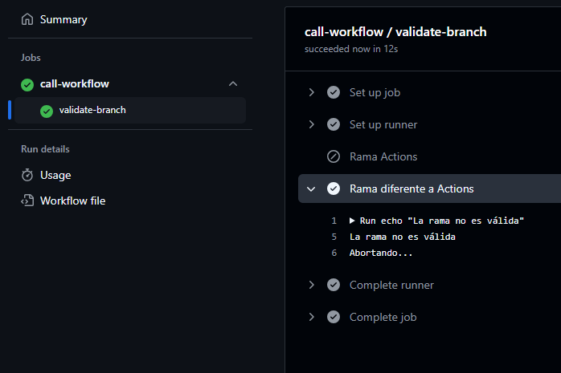

# Bloque de ejercicios - Reusables

Los workflows reutilizables permiten que un workflow sea llamado por otros workflows, facilitando la modularidad y la reutilización de código.

## Reusable 1 - Estructura básica de Reusables

Comprender como funciona la estructura de reusables a través de un ejemplo sencillo.

### Workflow reusable

Definimos el workflow:

````yml
name: Reusable1

# El disparador del reusable siempre será la llamada de otro workflow
on:
  workflow_call:

jobs:
  Mostrar_mensaje:
    runs-on: labs-runner
    steps:
      - run: echo "Hola"
````

### Workflow de llamada

Definimos un workflow manual que llame al reusable:

````yml
name: Call Reusable1

on:
  workflow_dispatch:

# Llamada del workflow reusable
jobs:
  call-workflow:
    uses: ./.github/workflows/reusable_1.yml
````

### Ejecución

Observamos el proceso de ejecución de nuestro workflow.


## Reusable 2 - Validar una rama

A través de un workflow reusable queremos discriminar acciones según la rama en la que se haga el workflow.

### Workflow reusable

Definimos el workflow:

````yml
# Definición del nombre del flujo de trabajo
name: Validación de rama (Reusable2)

# Evento que dispara el flujo de trabajo
on:
  # El flujo de trabajo se dispara cuando se llama desde otro flujo de trabajo
  workflow_call:

# Definición del trabajo
jobs:
  # Nombre del trabajo
  validate-branch:
    # El trabajo se ejecuta en un entorno de ejecución llamado 'labs-runner'
    runs-on: labs-runner
    # Pasos del trabajo
    steps:
      # Primer paso: Verificar si la rama es válida
      - name: Rama Actions 
        # Condición para ejecutar el paso: si la rama comienza con 'actions_ws1/'
        if: startsWith(github.event.branch, 'actions_ws1/')
        # Comando a ejecutar
        run: |
          echo "La rama es válida"
          echo "Ejecutando tarea principal..."
          sleep 5
          echo "Tarea principal"
      # Segundo paso: Verificar si la rama es diferente a 'actions_ws1/*'
      - name: Rama diferente a Actions
        # Condición para ejecutar el paso: si la rama no es igual a 'actions_ws1/*'
        if: github.event.branch != 'actions_ws1/*'
        # Comando a ejecutar
        run: |
          echo "La rama no es válida"
          echo "Abortando..."
````

### Workflow de llamada

Definimos el workflow:

````yml
name: Call Reusable2

on:
  workflow_dispatch:

jobs:
  call-workflow:
    uses: ./.github/workflows/reusable_2.yml

````

### Ejecución

Observamos el proceso de ejecución de nuestro workflow, como se realiza sobre una rama diferente a la definida, da un fallo.



## Reusable 3 - Despliegue por entornos

Comencemos creando nuestros entorno del repositorio, para ello debemos acceder en primer lugar a **Settings>Environments**.

En caso de que no veamos esta opción debemos asegurarnos de o bien tener Github pro o tener el repositorio con visibilidad pública.

Luego creamos nuestro primer entorno clickando sobre el botón ***New environment***.


<br>

Una vez creeemos nuestro entorno podremos acceder a las variables de entorno, creamos las necesarias.


<br>

Desde la misma pestaña que se menciona al principio podremos ver nuestros entornos creados.


### Workflow reusable

Definimos el workflow, se trabaja con un input pasado como parametro desde el workflow que llama al reusable:

````yml
# Definimos el nombre del workflow
name: Deploy to Environments

# Se ejecuta el workflow cuando se realiza un push en las ramas main o dev
on:
  push:
    branches:
      - main  # Rama principal
      - dev   # Rama de desarrollo

# Definimos un job llamado llamada
jobs:
  llamada:
    # Utilizamos el archivo de workflow deploy-enviromment.yml ubicado en .github/workflows
    uses: ./.github/workflows/deploy-enviromment.yml
    # Pasamos la variable env con el nombre de la rama actual
    with:
      env: $GITHUB_REF_NAME
````

### Workflow de llamada

Definimos el workflow:

````yml
# Definimos el nombre del workflow
name: Deploy to environment

# Se ejecuta el workflow cuando se llama desde otro workflow
on:
  workflow_call:
    # Definimos la entrada del workflow, que es el entorno al que se va a desplegar
    inputs:
      env:
        # Tipo de dato de la entrada, en este caso es un string
        type: string
        # La entrada es requerida
        required: true

# Definimos el job que se va a ejecutar
jobs:
  deploy:
    # El job se ejecuta en un runner auto-hospedado
    runs-on: self-hosted
    # Definimos los pasos que se van a ejecutar en el job
    steps:
      # Definimos el nombre del paso
      - name: Deploy to environment
        # El comando que se va a ejecutar en el paso
        run: echo "Deploying to ${{ inputs.env }}"
````

### Ejecución

Observamos el proceso de ejecución de nuestro workflow

