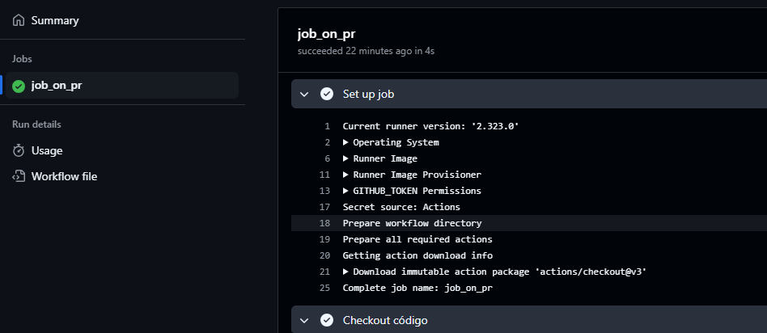
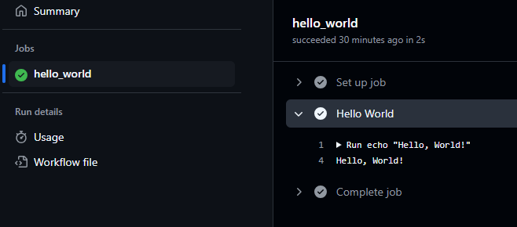
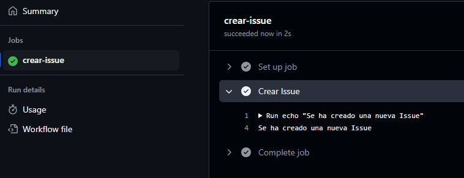
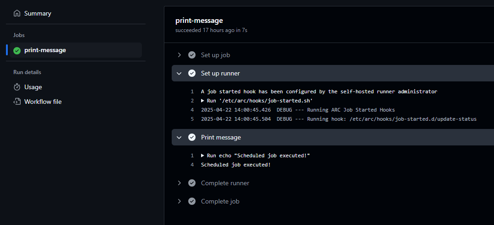

# Bloque de ejercicios - Triggers

## Trigger 1 - Pull Request

Workflow básico que se ejecute automáticamente al relizar un Pull Request.

### Workflow

Definimos el workflow:

````yml
# Definimos el nombre del workflow
name: Abrir Pull Request

# Especificamos el evento que dispara el workflow
on:
  # En este caso, el workflow se ejecuta cuando se abre un pull request
  pull_request:
    # Tipos de eventos de pull request que disparan el workflow
    types: [opened]

# Definimos el job que se ejecutará
jobs:
  # Nombre del job
  job_on_pr:
    # Especificamos el entorno en el que se ejecutará el job
    runs-on: labs-runner
    # Pasos que se ejecutarán en el job
    steps:
      # Paso para checar el código
      - name: Checkout código
        # Utilizamos la acción de checkout de GitHub Actions
        uses: actions/checkout@v3
````

### Ejecución

Observamos el proceso de ejecución de nuestro workflow.



## Trigger 2 - Push

Workflow básico que se ejecute automáticamente al relizar un Push.

### Workflow

Definimos el workflow:

````yml
# Definimos el nombre del workflow
name: Hello Push en la rama secundaria

# Seleccionamos el evento que dispara el workflow (push a una rama)
on:
  push:
    # Especificamos la rama que dispara el workflow
    branches:
      - actions_ws1

# Definimos el trabajo que se ejecutará
jobs:
  # Nombre del trabajo
  hello_world:
    # Especificamos el entorno donde se ejecutará el trabajo
    runs-on: labs-runner
    # Definimos los pasos que se ejecutarán en el trabajo
    steps:
      # Nombre del paso
      - name: Hello World
        # Comando que se ejecutará en el paso
        run: echo "Hello, World!"
````

### Ejecución

Observamos el proceso de ejecución de nuestro workflow.



## Trigger 3 - Issues

Workflow básico que se ejecute automáticamente al ocurrir una ***Issue***.

### Workflow

Definimos el workflow:

````yml
# Definimos el nombre de la acción
name: Crear Issue

# Seleccionamos el evento que dispara la acción (en este caso, cuando se abre una nueva issue)
on:
  issues:
    # Tipos de eventos que se van a escuchar (en este caso, solo cuando se abre una issue)
    types: [opened]

# Definimos el trabajo que se va a realizar
jobs:
  # Nombre del trabajo
  crear-issue:
    # Definimos el entorno en el que se va a ejecutar el trabajo
    runs-on: labs-runner
    # Definimos los pasos que se van a ejecutar en el trabajo
    steps:
      # Nombre del paso
      - name: Crear Issue
        # Comando que se va a ejecutar en el paso
        run: echo "Se ha creado una nueva Issue"
````

### Ejecución

Observamos el proceso de ejecución de nuestro workflow.



## Trigger 4 - Cronjob

Workflow básico que se ejecute automáticamente con una programación cada cierto tiempo.

### Workflow

Definimos el workflow:

````yml
# Definimos el nombre del trabajo programado
name: Daily Job

# Configuramos el evento que dispara el trabajo (en este caso, un cron)
on:
  # Definimos el cron que se ejecutará a las 12:00 (hora del runner) todos los días
  schedule:
    - cron: 0 12 * * *

# Definimos las tareas que se ejecutarán en el trabajo
jobs:
  # Nombre de la tarea
  print-message:
    # Definimos el entorno donde se ejecutará la tarea
    runs-on: labs-runner
    # Definimos los pasos que se ejecutarán en la tarea
    steps:
      # Nombre del paso
      - name: Print message
        # Comando que se ejecutará en el paso
        run: echo "Scheduled job executed!"
````

### Ejecución

Observamos el proceso de ejecución de nuestro workflow.

