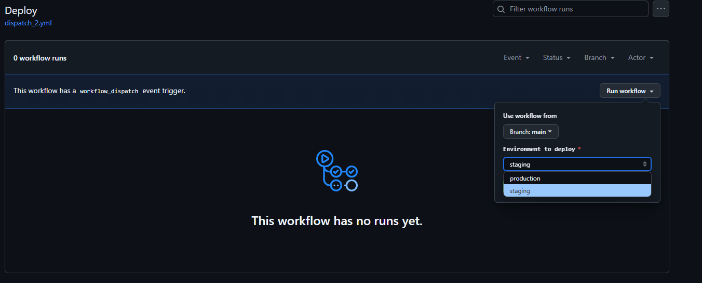

# Bloque de ejercicios - Dispatches

## Dispatch 1 - Mensaje personalizado

Workflow manual que se ejecuta junto a un mensaje personalizado pasado como parámetro.

### Workflow

Definimos el workflow:

````yml
# Definimos el nombre del workflow
name: Workflow manual

# Se especifica el evento que dispara el workflow
on:
  # En este caso, el workflow se dispara manualmente mediante el evento 'workflow_dispatch'
  workflow_dispatch:
    # Se definen las entradas del workflow
    inputs:
      # Se define una entrada llamada 'message' que es requerida
      message:
        # Se describe la entrada 'message'
        description: 'Mensaje personalizado'
        # Se indica que la entrada 'message' es requerida
        required: true

# Se define el trabajo 'print-message'
jobs:
  print-message:
    # Se especifica el entorno donde se ejecuta el trabajo
    runs-on: labs-runner
    # Se definen los pasos del trabajo
    steps:
      # Se define el paso 'Checkout'
      - name: Checkout
        # Se utiliza la acción 'actions/checkout@v2' para realizar el checkout del código
        uses: actions/checkout@v2
      # Se define el paso 'Ejecutar un Comando'
      - name: Ejecutar un Comando
        # Se ejecuta el comando 'echo' para imprimir un mensaje
        run: echo "Este workflow se ejecuta"
      # Se define el paso 'Imprimir mensaje'
      - name: Imprimir mensaje
        # Se ejecuta el comando 'echo' para imprimir el mensaje personalizado
        run: echo "El mensaje es ${{ github.event.inputs.message }}"
````

### Ejecución

Observamos el proceso de ejecución de nuestro workflow.


## Dispatch 2 - Elección de opciones

Workflow manual que se ejecuta elgiendo una opción que se pasará como parámetro.

### Workflow

Definimos el workflow:

````yml
# Definimos el nombre del flujo de trabajo
name: Deploy

# Definimos el evento que dispara el flujo de trabajo
on:
  # El flujo de trabajo se dispara manualmente mediante el evento "workflow_dispatch"
  workflow_dispatch:
    # Definimos las entradas del flujo de trabajo
    inputs:
      # Definimos la entrada "environment" que especifica el entorno de despliegue
      environment:
        # Descripción de la entrada
        description: 'Environment to deploy'
        # La entrada es obligatoria
        required: true
        # Valor predeterminado de la entrada
        default: 'staging'
        # Tipo de entrada (en este caso, una lista de opciones)
        type: choice
        # Opciones disponibles para la entrada
        options:
          - production
          - staging

# Definimos el trabajo "deploy"
jobs:
  deploy:
    # El trabajo se ejecuta en un entorno de ejecución llamado "labs-runner"
    runs-on: labs-runner
    # Definimos los pasos del trabajo
    steps:
      # Paso 1: Verificamos el código del repositorio
      - name: Checkout code
        # Utilizamos la acción "actions/checkout@v3" para verificar el código
        uses: actions/checkout@v3

      # Paso 2: Imprimimos el entorno de despliegue
      - name: Print environment
        # Utilizamos la acción "run" para ejecutar un comando en el entorno de ejecución
        run: echo "Deploying to ${{ github.event.inputs.environment }}"
````

### Ejecución

Observamos el proceso de ejecución de nuestro workflow.



## Dispatch 3 - Booleano

Workflow manual que se ejecuta eligiendo una opción de tipo booleano.

### Workflow

Definimos el workflow:

````yml
# Definimos el nombre del flujo de trabajo
name: Manual Workflow

# Se ejecuta el flujo de trabajo cuando se envía una solicitud de ejecución manual
on:
  workflow_dispatch:
    # Definimos una entrada de confirmación para el flujo de trabajo
    inputs:
      confirm:
        # Descripción de la entrada de confirmación
        description: 'Confirmación'
        # La entrada de confirmación es obligatoria
        required: true
        # Valor predeterminado de la entrada de confirmación
        default: 'false'
        # Tipo de entrada de confirmación (en este caso, una opción de selección)
        type: choice
        # Opciones disponibles para la entrada de confirmación
        options:
          - true
          - false

# Definimos un trabajo llamado "print-message"
jobs:
  print-message:
    # El trabajo se ejecuta en un entorno de ejecución llamado "labs-runner"
    runs-on: labs-runner
    # Definimos los pasos que se ejecutarán en el trabajo
    steps:
      # Definimos un paso llamado "Print message"
      - name: Print message
        # El paso ejecuta un comando en la consola
        run: |
          if [ "${{ github.event.inputs.confirm }}" = "true" ]; then
            echo "Confirmación positiva"
          else
            echo "Confirmación negativa"
          fi
````

### Ejecución

Observamos el proceso de ejecución de nuestro workflow.


