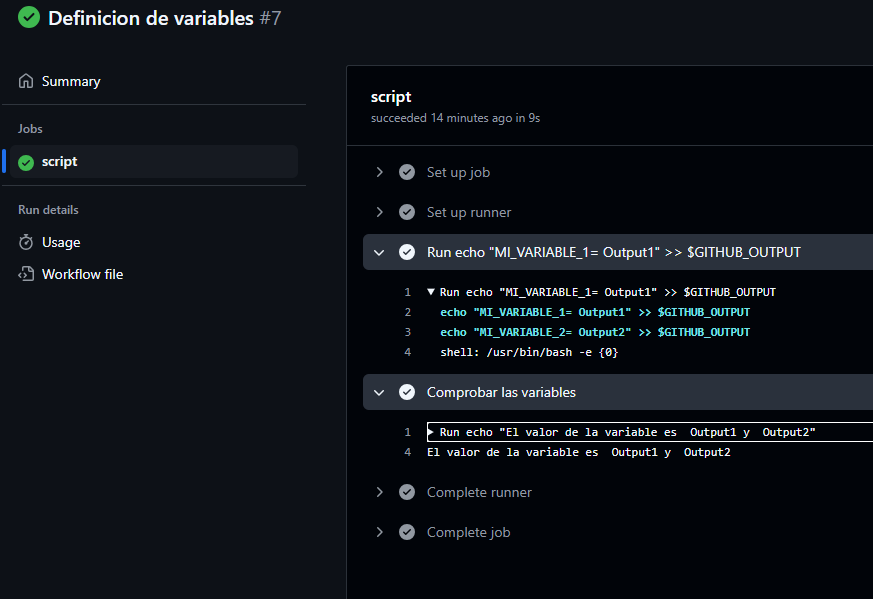
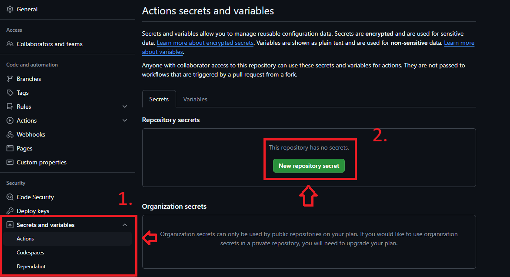
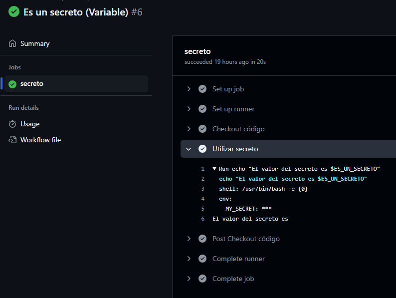
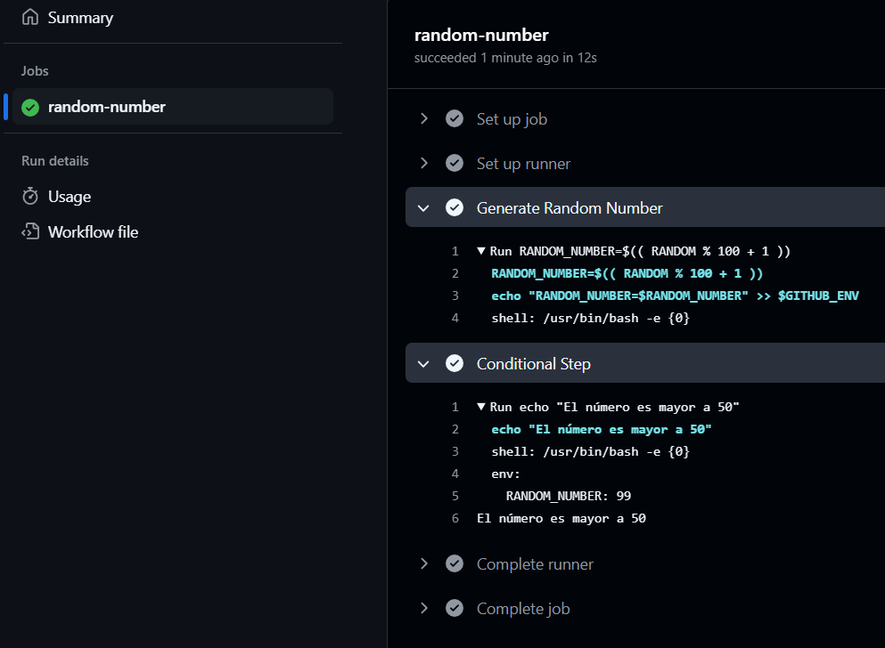
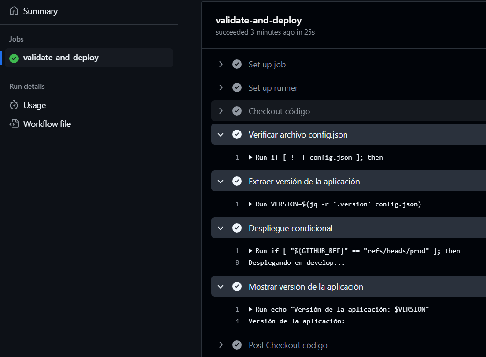
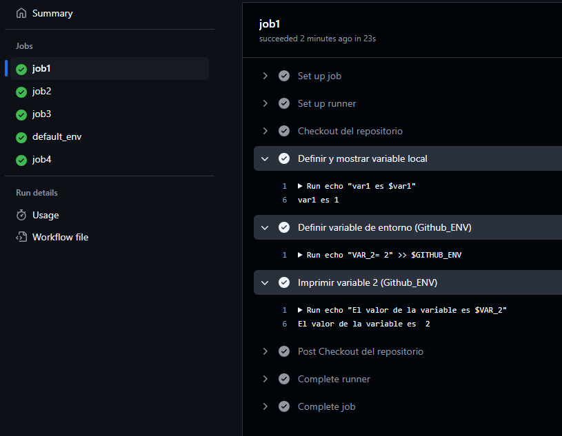
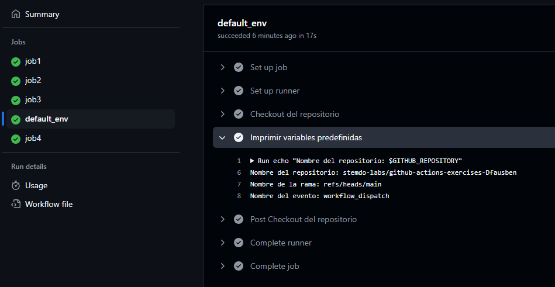

# Bloque de ejercicios - Variables

## Variable 1 - Outputs

### Workflow

Definimos el workflow:

````yml
name: Definicion de variables

on:
  workflow_dispatch:

jobs:
  script:
    runs-on: labs-runner
    steps:
    - id: step1
      run: |
        echo "MI_VARIABLE_1= Output1" >> $GITHUB_OUTPUT
        echo "MI_VARIABLE_2= Output2" >> $GITHUB_OUTPUT
    - name: Comprobar las variables
      run: echo "El valor de la variable es ${{ steps.step1.outputs.MI_VARIABLE_1 }} y ${{ steps.step1.outputs.MI_VARIABLE_2 }}"
````

### Ejecución

Observamos el proceso de ejecución de nuestro workflow.



## Variable 2 - Secretos

### Workflow

Definimos el workflow:

````yml
name: Es un secreto (Variable)

on:
  workflow_dispatch:

jobs:
  secreto:
    runs-on: labs-runner
    steps:
      - name: Checkout código
        uses: actions/checkout@v4
      - name: Utilizar secreto
        run: echo "El valor del secreto es $ES_UN_SECRETO"
        env:
          MY_SECRET: ${{ secrets.ES_UN_SECRETO }}
````

### Ejecución

Creamos los secretos desde Settings > Secrets and variables > Actions



<br>

Observamos el proceso de ejecución de nuestro workflow.



## Variables 3 - Numero aleatorio

### Workflow

Definimos el workflow:

````yml
name: Random Number Workflow

on:
  workflow_dispatch:

jobs:
  random-number:
    runs-on: labs-runner
    steps:
      - name: Generate Random Number
        run: |
          RANDOM_NUMBER=$(( RANDOM % 100 + 1 ))
          echo "RANDOM_NUMBER=$RANDOM_NUMBER" >> $GITHUB_ENV

      - name: Conditional Step
        if: env.RANDOM_NUMBER > 50
        run: |
          echo "El número es mayor a 50"
````

### Ejecución

Observamos el proceso de ejecución de nuestro workflow.



## Variables 4 - Validación y despliegue condicional

### Workflow

Definimos el workflow:

````yml
name: Validación y despliegue condicional

on:
  push:
    branches:
      - prod
      - dev

jobs:
  validate-and-deploy:
    runs-on: labs-runner
    steps:
      - name: Checkout código
        uses: actions/checkout@v3

      - name: Verificar archivo config.json
        run: |
          if [ ! -f config.json ]; then
            echo "El archivo config.json no existe"
            exit 1
          fi
          if ! jq -e . config.json > /dev/null; then
            echo "El archivo config.json no tiene formato JSON válido"
            exit 1
          fi

      - name: Extraer versión de la aplicación
        id: app-version
        run: |
          VERSION=$(jq -r '.version' config.json)
          echo "VERSION=$VERSION" >> $GITHUB_OUTPUT

      - name: Despliegue condicional
        if: github.event_name == 'push'
        run: |
          if [ "${GITHUB_REF}" == "refs/heads/prod" ]; then
            echo "Desplegando en producción..."
          elif [ "${GITHUB_REF}" == "refs/heads/dev" ]; then
            echo "Desplegando en develop..."
          fi

      - name: Mostrar versión de la aplicación
        run: |
          echo "Versión de la aplicación: $VERSION"
````

### Ejecución

Observamos el proceso de ejecución de nuestro workflow.



## Variables 5 - Definiciones y tipos de variables

### Workflow

Definimos el workflow:

````yml
name: Variables_5

on:
  workflow_dispatch:
permissions:
  contents: write

jobs:
  job1:
    runs-on: labs-runner
    steps:
      - name: Checkout del repositorio
        uses: actions/checkout@v4
      - name: Definir y mostrar variable local
        env:
          var1: 1
        run: echo "var1 es $var1"
      - name: Definir variable de entorno (Github_ENV)
        run: echo "VAR_2= 2" >> $GITHUB_ENV
      - name: Imprimir variable 2 (Github_ENV)
        run: echo "El valor de la variable es $VAR_2"
  job2:
    runs-on: labs-runner
    outputs:
      output: ${{ steps.step1.outputs.var_step_output }}
    steps:
      - name: Definir output
        id: step1 
        run: echo "var_step_output= Output1" >> $GITHUB_OUTPUT
      - name: Imprimir output
        run: echo "El valor de la variable es ${{ steps.step1.outputs.var_step_output }}"
  job3:
    runs-on: labs-runner
    outputs:
      var3: ${{ steps.step3.outputs.var3 }}
    steps:
      - name: Checkout del repositorio
        uses: actions/checkout@v4
      - name: Imprimir variable 2
        run:  echo "La variable de entorno es $VAR_2"
      - name: Definir Output var3
        id: step3
        run: echo "var3= 3" >> $GITHUB_OUTPUT
  job4:
    runs-on: labs-runner
    needs: job3
    steps:
      - name: Imprimir v3 
        env:
          VAR3: ${{needs.job3.outputs.var3}}
        run:  echo "El valor de la variable es $VAR3"
  default_env:
    runs-on: labs-runner
    steps:
      - name: Checkout del repositorio
        uses: actions/checkout@v4
      - name: Imprimir variables predefinidas
        run: |
          echo "Nombre del repositorio: $GITHUB_REPOSITORY"
          echo "Nombre de la rama: $GITHUB_REF"
          echo "Nombre del evento: $GITHUB_EVENT_NAME"
````

### Ejecución

Observamos el proceso de ejecución de nuestro workflow.



